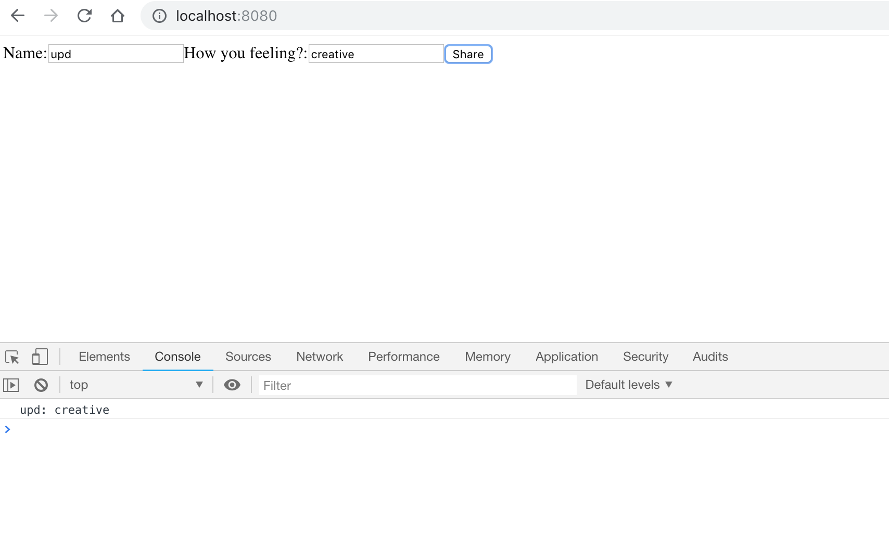

run the app
-----------

```
npm install
```

- webpack - a module bundler which takes modules with dependencies and generates static assets

```
$ node_modules/.bin/webpack -d
Hash: 33c1b5f6d934201ea788
Version: webpack 4.13.0
Time: 76ms
Built at: 06/28/2018 11:22:33 PM
    Asset      Size  Chunks             Chunk Names
bundle.js  4.21 KiB    main  [emitted]  main
[./src/client/app/index.jsx] 23 bytes {main} [built]
```

- babel - make JSX browser understandable

run in one shot:

```
node_modules/.bin/webpack -d; npm start
```



resources
---------

https://reactjs.org/docs/hello-world.html

tooling
--------

https://github.com/syl20bnr/spacemacs/tree/master/layers/%2Bframeworks/react#install

add react to `~/.spacemacs`, 

```lisp
   dotspacemacs-configuration-layers                                                                
   '(                                                                                               
     markdown                                                                                       
     clojure                                                                                        
     javascript                                                                                     
     react                                                                                          
     html
```
