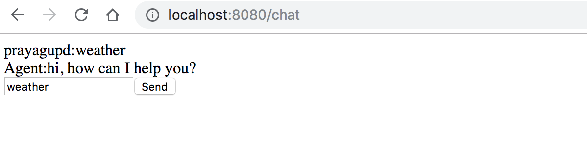

run the app
-----------

depends on https://github.com/duwamish-os/chat-server

```
npm install
```

[webpack](https://webpack.js.org/concepts/) 
-----------

a module bundler which takes modules with dependencies and generates static assets
based on sources defined in `webpack.config.js`, in this example sources are `.JSX`

```bash
$ node_modules/.bin/webpack -d
Hash: 33c1b5f6d934201ea788
Version: webpack 4.13.0
Time: 76ms
Built at: 06/28/2018 11:22:33 PM
    Asset      Size  Chunks             Chunk Names
bundle.js  4.21 KiB    main  [emitted]  main
[./src/client/app/index.jsx] 23 bytes {main} [built]
```

[babel compiler](https://babeljs.io/docs/en/)
----------

make JSX browser understandable

```bash
npm install -g babel-core
npm install -g babel-repl

babel-repl
> [1, 2, 3].map((n) => n * 2);
[ 2, 4, 6 ]

>.exit
```

run in one shot:

```
node_modules/.bin/webpack -d; npm start
```



TODO
----

- update components to compile

```
  entry: {                                                                                                                        
          index: APP_DIR + '/index.jsx'                                                                
  }, 
```

resources
---------

https://reactjs.org/docs/hello-world.html

tooling
--------

https://github.com/syl20bnr/spacemacs/tree/master/layers/%2Bframeworks/react#install

add react to `~/.spacemacs`, 

```lisp
   dotspacemacs-configuration-layers                                                                
   '(                                                                                               
     markdown                                                                                       
     clojure                                                                                        
     javascript                                                                                     
     react                                                                                          
     html
```
